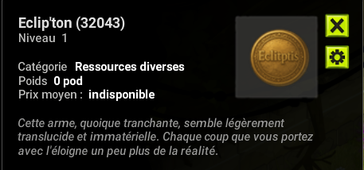
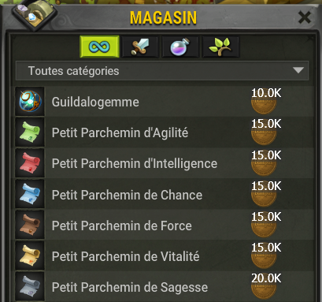
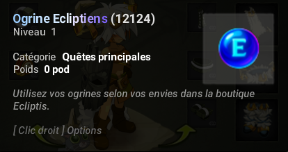

🪙 La Monnaie d'Eclitpis : L'Eclip'ton
En plus des Kamas, Ecliptis possède sa propre monnaie unique, essentielle à votre progression : L'Eclip'ton !

❓ Qu'est-ce que L'Eclip'ton ?
L'Eclip'ton (💎) est la monnaie phare du serveur. C'est elle qui vous permettra d'acheter les objets les plus convoités pour vous optimiser.

💰 Comment l'obtenir ?
C'est très simple : les Eclip'ton se droppent automatiquement à la fin de chaque combat que vous remportez contre des monstres. Plus vous combattez, plus vous vous enrichissez !

Vous pouvez voir votre solde d'Eclip'ton directement dans votre inventaire, à côté de vos Kamas.

🏪 À quoi servent les Eclip'ton ?
Votre fortune en Eclip'ton vous donne accès à une boutique spéciale ! Vous pouvez échanger vos Es'Ton contre des objets puissants auprès du PNJ  nommé le "Broyeur d'Es'Ton".

Ce PNJ vous propose un MAGASIN rempli d'objets utiles :

📜 Parchemins de Caractéristique +50 :

Petit Parchemin d'Agilité : 15 000 Eclip'ton

Petit Parchemin d'Intelligence : 15 000 Eclip'ton

Petit Parchemin de Chance : 15 000 Eclip'ton

Petit Parchemin de Force : 15 000 Eclip'ton

Petit Parchemin de Sagesse : 20 000 Es'Ton

Petit Parchemin de Vitalité : 15 000 Eclip'ton

🛡️ Guildalogemme : 10 000 Eclip'ton

Astuce : Farmez les Eclip'ton pour monter rapidement toutes vos caractéristiques à 200 !

# 💎 Les Ogrines sur Ecliptis Ecliptiens

## 🌟 Qu'est-ce que les Ogrines Ecliptiens ?

Les **Ogrines** sont une monnaie **premium** sur le serveur **Ecliptis**, utilisée pour obtenir des avantages exclusifs, des objets rares, ou encore des services spéciaux.  
Elles sont **séparées de la monnaie classique (Eclip'Ton)** et servent à valoriser votre progression tout en soutenant le serveur.

---

---

## 🪄 Comment obtenir des Ogrines Ecliptiens ?

Il existe plusieurs moyens pour en acquérir :

| 🧙‍♂️ **Événements spéciaux** | Des concours, tournois ou animations permettent parfois de gagner des Ogrines. 
| 💎 **Dons / Boutique du serveur** | Vous pouvez obtenir des Ogrines en soutenant le serveur via la boutique officielle. 
| 🎁 **Récompenses communautaires** | Certains paliers d’objectifs Discord ou d’événements communautaires offrent des Ogrines à tous les joueurs. 
| 🏆 **Classements & Tournois** | Les meilleurs joueurs de certaines catégories (votes) reçoivent un gain en Ogrines. | En fin de saison |

---

## 🏪 À quoi servent les Ogrines Ecliptiens ?

Les Ogrines Ecliptiens peuvent être dépensées pour obtenir divers avantages :

- 🎨 **Objets cosmétiques** : panoplies, familiers, auras et effets visuels uniques  
- ⚙️ **Services** : changement de classe, renomination, transferts de ressources  
- ⚔️ **Boosts temporaires** : bonus d’XP, de drop ou de métiers  
- 🏰 **Objets exclusifs** : familiers spéciaux, Dofus alternatifs ou items rares  

---

## 📍 Où les utiliser ?

Les Ogrines peuvent être échangées ou dépensées :

- Via la **Boutique Ogrines**, situé dans le panel de téleportation    
- Via **Havres des PNJ**, située dans le panel de téleportation

---

## 💡 Astuce du serveur
> Conservez vos Ogrines pour les offres limitées : certains objets légendaires ou cosmétiques ne sont disponibles que durant les événements spéciaux 🎁

---

## 🔄 Informations importantes
 
- Les taux de conversion et les objets disponibles peuvent **évoluer au fil des mises à jour**.  
- Toute tentative de duplication ou d’exploitation des Ogrines est **strictement interdite** ⚠️

