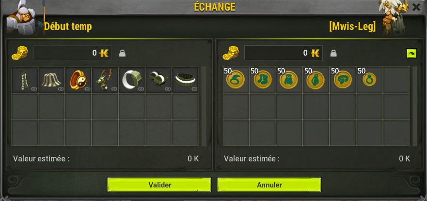

# 🌅 Bien Débuter sur Ecliptis

Bienvenue, jeune aventurier !  
Tu viens tout juste d’arriver dans le monde d’**Ecliptis**, et ton premier objectif sera de te familiariser avec les mécaniques du serveur avant de partir à la conquête du Monde des Douze. ⚔️  

---

## 🏝️ Première Étape : Direction Incarnam

Dès ton arrivée, tu seras transporté dans la **zone d’Incarnam**, le lieu d’entraînement pour tous les nouveaux aventuriers.  
C’est ici que tu apprendras les bases du serveur et que tu commenceras à forger ton futur héros.  

Ton but dans cette zone est simple :  
- 🌾 **Explorer les différentes zones d’Incarnam**  
- 🪓 **Combattre les monstres** pour récupérer des ressources spécifiques  
- 📦 **Dropper 50 ressources de chaque type**  

Une fois ces ressources collectées, tu devras te rendre auprès du PNJ **🧙‍♂️ Début Temp**, situé en [-2,-3].
Apporte-lui toutes les ressources demandées, et il t’échangera **un premier équipement complet** 🛡️ — idéal pour affronter les premiers défis du monde extérieur.

------------------------------------------------------------------------------------------------------------------------------------------------------------------

------------------------------------------------------------------------------------------------------------------------------------------------------------------

## 💎 Les Reliques d’Incarnam

Pendant ton exploration d’Incarnam, garde l’œil ouvert ! 👀  
Certains **monstres de la zone** ont une **chance rare de faire tomber une Relique du Débutant**, un objet unique symbolisant ta première véritable découverte sur Ecliptis.  

Ces reliques sont **collectionnables**, et pourront être utilisées plus tard dans ton aventure pour débloquer **des récompenses spéciales** 🔮.

---

## 🗺️ Et Après ?

Une fois ton équipement obtenu et ta relique en poche, il est temps de **quitter Incarnam** pour rejoindre le **Monde des Douze**.  
Tu pourras alors :  
- 🎯 Commencer ton aventure principale  
- ⚒️ Découvrir les métiers du serveur  
- 💰 Gagner tes premiers **Ecli'Tons**  
- 🏹 Explorer les zones de haut niveau et leurs secrets  

> 💡 Conseil : prends le temps de bien explorer Incarnam avant de partir — certains secrets ou monstres rares n’apparaissent qu’à des moments précis !

---

📜 *Dernière mise à jour :* Novembre 2025  
